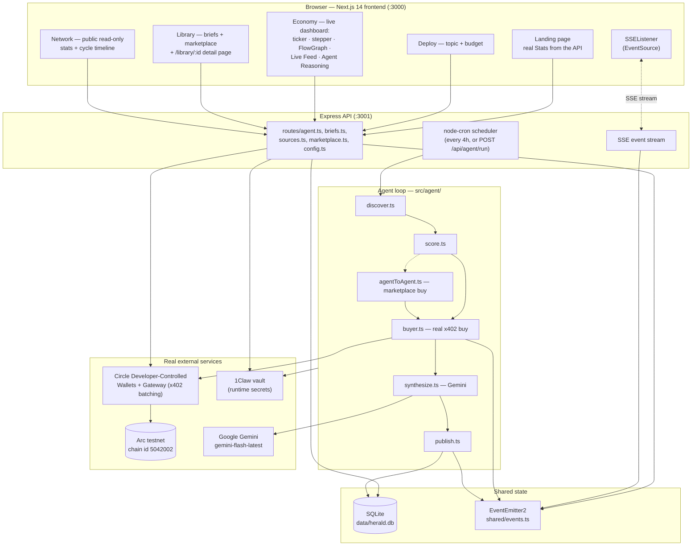
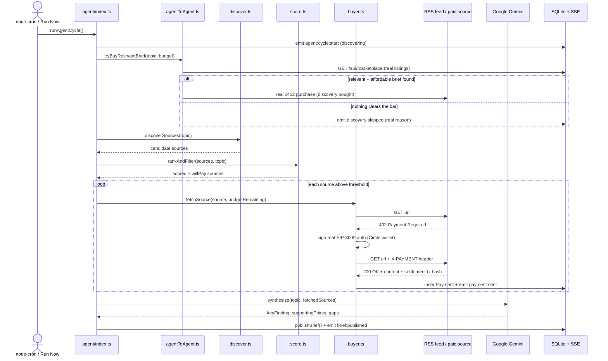
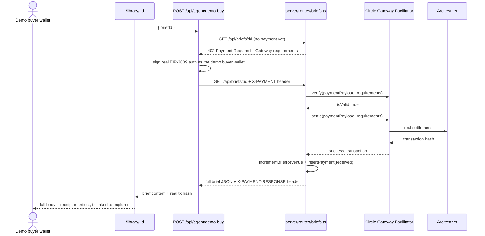
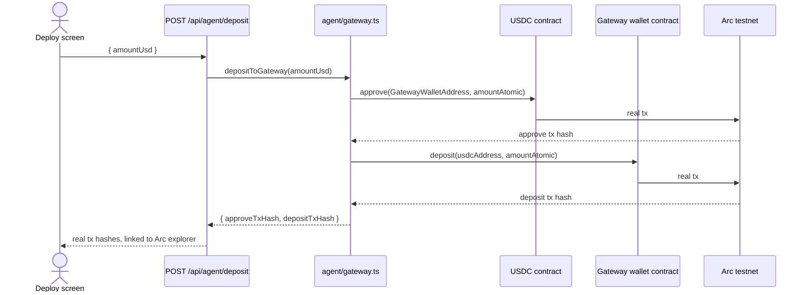

# HERALD

### *The agent that pays to learn and sells what it knows.*

Built for the **Lepton Agents Hackathon** (Canteen × Circle × Arc).

**Live demo (frontend only):** [lepton-blue.vercel.app](https://lepton-blue.vercel.app)
— the UI is public, but every API call (wallet balance, live feed, deploy,
buy) only works if you're also running the backend locally on the same
machine (see [Local Setup](#local-setup)). Vercel only hosts the Next.js
frontend; the Express API needs a persistent process (a writable SQLite
file, a 4-hour cron scheduler, long-lived SSE connections) that serverless
functions can't provide.

---

## The Problem in One Sentence

Every autonomous research agent today either scrapes the open web for free
(no compensation for the people who wrote what it reads) or sits behind a
subscription a human has to manage — there's no way for an agent to pay a
fraction of a cent, on its own, for exactly the one article it needs right
now, and no way for it to charge other agents for what it produces in
return.

## Why This Matters

- **Agents need a payment rail, not a credit card.** A human clicking
  "subscribe" doesn't compose with an unattended `node-cron` loop. x402
  revives HTTP's own `402 Payment Required` status code as a real
  request/response payment protocol — no separate checkout, no stored card,
  just a signed authorization attached to the same HTTP request that got
  rejected.
- **One-sided demos don't prove an economy.** Most "agent pays for content"
  demos only exercise the buy side, because free RSS never returns a real
  402. HERALD is genuinely two-sided: the same wallet buys sources *and*
  sells research briefs to other agents, so both the buy-side and sell-side
  x402 code paths fire for real, against real counterparties.
- **"Real" has to be checkable, not just claimed.** Every dollar amount,
  wallet address, and transaction hash on screen in HERALD comes from a
  live database row or a live API call — see [Verify It's Real](#verify-its-real)
  for exactly how to check that yourself in under a minute.

---

## What HERALD Actually Does

```
Without a payment rail (today's scrapers):          With HERALD × x402:
  fetch(url)                                            fetch(url)
  → 200 OK, free, uncompensated                         → 402 Payment Required
  → no way to pay for anything better                   → agent signs a real EIP-3009
                                                            authorization via its Circle
                                                            wallet
                                                         → resends with X-PAYMENT header
                                                         → Circle Gateway settles on Arc
                                                            testnet, content unlocks
```

Every research cycle:

1. **Discover** — pull candidate sources from RSS/news feeds for the
   configured topic (plus a check of HERALD's own marketplace for a
   relevant, already-published brief from another agent — see
   `src/agent/agentToAgent.ts`).
2. **Score** — a transparent, rule-based formula rates each source's
   relevance, freshness, domain trust, and length (`src/agent/score.ts`).
3. **Pay** — sources clearing the threshold get a real x402 nanopayment,
   signed by the agent's Circle Developer-Controlled Wallet
   (`src/agent/buyer.ts`).
4. **Synthesize** — Gemini writes a short, cited brief from what it just
   paid to read (`src/agent/synthesize.ts`).
5. **Publish** — the brief goes behind HERALD's own x402 paywall
   (`src/server/routes/briefs.ts`) so other agents (or a human, via their
   own wallet) can pay to read it.

The same wallet is the buyer in step 3 and the seller in step 5 — a live,
sub-cent, two-sided micro-economy, not a demo of one side of it.

---

## Architecture



---

## How Circle / Arc / x402 / 1Claw / Gemini Are Used

Real code, not illustrative pseudocode — pulled directly from the source
files named below.

### 1. Circle Developer-Controlled Wallets

Three separate real wallets on Arc testnet: the agent's own, a sources
treasury (so the buy-side path pays a genuinely different party), and a
demo buyer wallet (so purchases in the UI aren't the agent paying itself).

```ts
// src/agent/wallet.ts — provisioning + balance reads against Circle's real API
const wallet = await circleClient.createWallets({ walletSetId, blockchains: ['ARC-TESTNET'], count: 1 });
```

### 2. Real x402 buy-side settlement

```ts
// src/agent/buyer.ts — signing a real EIP-3009 authorization via Circle
const signer = await getCircleEvmSigner();
const scheme = new BatchEvmScheme(signer);
const { x402Version, payload } = await scheme.createPaymentPayload(2, requirements);
```

### 3. Real x402 sell-side verification + settlement

```ts
// src/server/routes/briefs.ts — Circle's real Gateway facilitator, not a mock
const verifyResult = await facilitator.verify(paymentPayload, requirements);
const settleResult = await facilitator.settle(paymentPayload, requirements);
```

### 4. Real on-chain Circle Gateway deposits

```ts
// src/agent/gateway.ts — a genuine approve + deposit pair, both real tx hashes
await executeContractCall(usdcAddress, 'approve(address,uint256)', [GATEWAY_WALLET_ADDRESS, amountAtomic]);
await executeContractCall(GATEWAY_WALLET_ADDRESS, 'deposit(address,uint256)', [usdcAddress, amountAtomic]);
```

### 5. 1Claw vault — runtime secrets

```ts
// src/agent/secrets.ts — Circle/Gemini keys are fetched at runtime, never left in process.env
const apiKey = await getSecret('CIRCLE_API_KEY');
```

### 6. Google Gemini — synthesis

```ts
// src/agent/synthesize.ts — writes the brief from content the agent actually paid to read
const result = await model.generateContent(buildSynthesisPrompt(topic, fetchedSources));
```

---

## Full Trade Flow — Sequence Diagrams

### Research cycle (discover → score → pay → synthesize → publish)



### Brief purchase (x402 sell-side, e.g. from `/library/:id`)



### Circle Gateway deposit (funding the agent's spend budget)



---

## Verify It's Real

Don't take the pitch above on faith — every claim in it is checkable in
under a minute, without reading a line of code.

**1. The agent wallet is a real address on a real (test) chain.**
Open it on the [Arc testnet explorer](https://testnet.arcscan.app/address/0x1fc8b69f563d2f3fe54ca8a693921f53d11eab89)
— or, once you've run your own `provision:wallet`, your own wallet's address
is on the `/how-it-works` page, with a one-click copy and explorer link (also
`GET /api/agent/chain-info`, no auth required).

**2. A brief's paywall is a real HTTP 402, not a fake "upgrade to pro" dialog:**

```bash
BRIEF_ID=$(curl -s http://localhost:3001/api/briefs?limit=1 | node -pe 'JSON.parse(require("fs").readFileSync(0))[0].id')
curl -i http://localhost:3001/api/briefs/$BRIEF_ID
```

Expect back a real `HTTP/1.1 402 Payment Required` with a JSON body listing
Circle Gateway's exact payment requirements (asset, amount, `payTo`) — the
same response the agent's own buy-side code parses in `src/agent/buyer.ts`.

**3. Payments settle for real, on-chain, and you can watch it happen.** The
Economy page's Live Feed, each brief's Payment Receipts manifest
(`/library/:id`), and the public `/network` dashboard all link real
transaction hashes to the explorer — a genuine on-chain hash links out; a
Circle Gateway x402 *settlement id* (its batched-payment API returns an id,
not an on-chain hash, since batched payments settle on-chain later) is
labeled "settlement" and deliberately left unlinked rather than pointing at
a URL that wouldn't resolve. Click "Run Now" on the Economy page and watch
the stepper, the flow graph, and the feed all update from the same real
cycle in real time.

**4. Purchases in the UI complete for real.** The Library's "Read"/"Buy"
buttons pay through a separate, real **demo buyer wallet** (clearly labeled
in the UI, `src/agent/demoBuyer.ts`) rather than the agent's own wallet —
Circle's Gateway facilitator correctly rejects a wallet paying itself as
`self_transfer` (confirmed live), so a genuinely independent buyer is what
actually completes a purchase in this single-agent deployment.

---

## Deployed Addresses — Arc Testnet (chain id `5042002`)

> Rerun `curl http://localhost:3001/api/agent/chain-info` against a running
> instance for current values — a fresh `provision:wallet` run generates a
> new agent wallet.

| What | Address |
|---|---|
| Agent wallet | [`0x1fc8b69f563d2f3fe54ca8a693921f53d11eab89`](https://testnet.arcscan.app/address/0x1fc8b69f563d2f3fe54ca8a693921f53d11eab89) |
| Sources treasury wallet | [`0x6c1a620d4d8eded0ee2de5a4051e1d1ef3c90e9d`](https://testnet.arcscan.app/address/0x6c1a620d4d8eded0ee2de5a4051e1d1ef3c90e9d) |
| USDC contract | [`0x3600000000000000000000000000000000000000`](https://testnet.arcscan.app/address/0x3600000000000000000000000000000000000000) |
| Gateway wallet contract | [`0x0077777d7eba4688bdef3e311b846f25870a19b9`](https://testnet.arcscan.app/address/0x0077777d7eba4688bdef3e311b846f25870a19b9) |
| Explorer | https://testnet.arcscan.app |

---

## Repository Structure

```
lepton/
├── src/
│   ├── agent/                       # The autonomous loop
│   │   ├── index.ts                 # runAgentCycle() — orchestrates every step
│   │   ├── discover.ts              # RSS/news source discovery
│   │   ├── score.ts                 # rankAndFilter() — relevance/freshness/trust
│   │   ├── buyer.ts                 # real x402 buy-side (fetch → 402 → sign → pay)
│   │   ├── agentToAgent.ts          # marketplace purchase from another agent
│   │   ├── synthesize.ts            # Gemini brief synthesis + priceBrief()
│   │   ├── publish.ts               # writes the brief, sets its x402 price
│   │   ├── wallet.ts / withdraw.ts  # Circle wallet ops, real on-chain withdrawal
│   │   ├── gateway.ts               # real Circle Gateway approve+deposit
│   │   ├── demoBuyer.ts             # separate real wallet for UI purchases
│   │   ├── circleSign.ts            # Circle EVM signer for x402 authorizations
│   │   └── secrets.ts               # 1Claw vault reads with retry/backoff
│   │
│   ├── server/                      # Express API (:3001)
│   │   ├── index.ts
│   │   └── routes/
│   │       ├── agent.ts             # status, balance, deposit, withdraw, run, cycles, SSE
│   │       ├── briefs.ts            # x402 sell-side gate (verify + settle)
│   │       ├── sources.ts           # x402 gate for original paid articles
│   │       ├── marketplace.ts       # public brief listings for agent-to-agent buys
│   │       └── config.ts            # topic/budget/price-floor config
│   │
│   ├── app/                         # Next.js 14 frontend (:3000)
│   │   ├── page.tsx                 # landing page (+ components/landing/)
│   │   ├── deploy/page.tsx          # onboarding: topic, budget, price floor
│   │   ├── economy/                 # live dashboard
│   │   │   ├── page.tsx, PaymentTicker.tsx, CycleStatus.tsx,
│   │   │   ├── BalanceCard.tsx, FlowGraph.tsx, LiveFeed.tsx,
│   │   │   └── ReasoningPanel.tsx, BriefPreview.tsx, CycleReports.tsx
│   │   ├── library/
│   │   │   ├── page.tsx             # your briefs + marketplace
│   │   │   └── [id]/page.tsx        # full brief + payment-receipt manifest
│   │   ├── network/                 # public read-only dashboard
│   │   │   ├── page.tsx, CycleTimeline.tsx
│   │   └── how-it-works/page.tsx    # x402 explained + live verification panel
│   │
│   ├── shared/                      # db.ts (SQLite), events.ts (SSE bus), types.ts, chain.ts
│   ├── lib/                         # explorer.ts, format.ts, dedupe.ts, useCountUp.ts
│   └── components/ui/               # shadcn-style primitives for the landing page
│
├── scripts/                         # provisioning, seeding, and all 3 test layers
├── data/herald.db                   # SQLite — briefs, payments, cycle reports
├── README.md, PROJECT_REPORT.md, DEMO_SCRIPT.md, SUBMISSION_CHECKLIST.md
```

---

## Tech Stack

| Layer | Technology |
|---|---|
| Frontend | Next.js 14 (App Router), React, TypeScript, Tailwind v3 |
| API server | Express, Node.js, `node-cron`, Server-Sent Events |
| Database | SQLite (`better-sqlite3`) |
| Payments | x402 protocol, `@circle-fin/x402-batching` (`BatchEvmScheme` client, `BatchFacilitatorClient` server) |
| Wallets | Circle Developer-Controlled Wallets API |
| Settlement network | Arc testnet (chain id `5042002`) |
| Secrets | 1Claw vault (`@1claw/sdk`) |
| Synthesis | Google Gemini (`gemini-flash-latest`) |
| Testing | Custom unit runner, live-server integration runner, Playwright (real Chromium) |

---

## Local Setup

### Prerequisites

```bash
node -v       # v20+
```

You'll also need accounts with:

- **[1Claw](https://1claw.dev)** — vault that stores all API keys/secrets; the
  agent fetches them at runtime and they never live in `process.env` during
  normal operation.
- **[Circle](https://console.circle.com)** — Developer-Controlled Wallets API
  key, used to provision the agent's wallet on Arc testnet.
- **[Google AI Studio](https://aistudio.google.com/apikey)** — free Gemini API
  key, used for brief synthesis.
- **[TestMint](https://testmint.myproceeds.xyz)** — x402-gated faucet to fund
  the agent wallet with testnet USDC.

### Install + configure

```bash
npm install
cp .env.example .env.local
```

Fill in `ONECLAW_AGENT_ID`, `ONECLAW_AGENT_API_KEY`, `ONECLAW_VAULT_ID` (from
your 1Claw vault) and `CIRCLE_API_KEY` / `GEMINI_API_KEY`. Leave
`HERALD_WALLET_ID`, `HERALD_WALLET_ADDRESS`, and `CIRCLE_ENTITY_SECRET` blank —
the next step fills them in.

### Provision wallets + seed content

```bash
npm run provision:wallet          # creates the agent's real Arc-testnet wallet
                                   # copy the printed Wallet ID / Address / Entity Secret into .env.local
npm run seed:vault                # pushes CIRCLE_API_KEY, CIRCLE_ENTITY_SECRET, GEMINI_API_KEY,
                                   # HERALD_WALLET_ID/ADDRESS into your 1Claw vault
npm run provision:sources-wallet  # creates a second, separate treasury wallet
npm run seed:sources              # populates real, x402-gated original content
```

### Fund the wallet

Visit [testmint.myproceeds.xyz](https://testmint.myproceeds.xyz), pay a
nanopayment to mint testnet USDC, and send it to the `HERALD_WALLET_ADDRESS`
printed above.

### Run

```bash
npm run dev
```

Starts the Next.js frontend (`:3000`) and the Express API + agent scheduler
(`:3001`) together. Open `http://localhost:3000`, configure a topic/budget on
the Deploy screen, and watch it run on the Economy screen (or open
`/economy?demo=1` for a clean, zoomed presentation view).

## Scripts

| Command | What it does |
|---|---|
| `npm run dev` | Frontend + API server together (development) |
| `npm run build` / `npm run start` | Production build / start |
| `npm run provision:wallet` / `provision:sources-wallet` | Create the agent / sources-treasury wallet on Arc testnet |
| `npm run seed:vault` | Push secrets from `.env.local` into the 1Claw vault |
| `npm run seed:sources` | Populate real x402-gated original content the agent can buy |
| `npm run test:unit` | 30 pure-logic checks — no server needed |
| `npm run test` | 10 integration checks against a live server — real cycle, real x402 purchase, agent-to-agent self-exclusion |
| `npm run test:playwright` | 38 real-Chromium checks — every page at 1440px/375px, overlap detection, ticker, brief detail, skip-grouping, `?demo=1`, reduced-motion |
| `npm run test:all` | Everything above in sequence: lint → typecheck → unit → integration → Playwright |
| `npm run demo` | Triggers one real cycle and prints a recording walkthrough — see `DEMO_SCRIPT.md` |

## End-to-End Test Flow

1. **Deploy** — set a topic and weekly budget; the real wallet balance is
   checked client-side before the deposit is attempted.
2. **Deposit** — `POST /api/agent/deposit` executes a real on-chain
   `approve` + `deposit` pair into Circle Gateway.
3. **Run a cycle** — click "Run Now" (or `?demo=1` for a clean recording
   view): discover → score → pay → synthesize → publish, all real, all
   visible live in the ticker, stepper, FlowGraph, Live Feed, and Agent
   Reasoning panel.
4. **Read a brief** — open `/library/:id`; unlock the full body via the
   real demo buyer wallet; scroll to Payment Receipts for the full
   manifest — every citation linked to its own settlement/tx.
5. **Check the network** — `/network` shows the same real numbers with no
   login, plus a per-cycle P&L timeline.
6. **Reproduce the 402 yourself** — see [Verify It's Real](#verify-its-real).

Full breakdown of all three test layers (unit/integration/Playwright) is in
`SUBMISSION_CHECKLIST.md`.

---

## Known Limitations

- **The Vercel deployment is frontend-only.** Vercel only runs serverless
  functions; HERALD's Express API needs a persistent process (a writable
  SQLite file, a 4-hour cron scheduler, long-lived SSE connections) that
  serverless functions can't provide. Run the backend locally to see the
  live features work end to end.
- **Agent-to-agent purchasing is real code with a single-instance no-op.**
  Every cycle, the agent checks `/api/marketplace` for another agent's
  brief worth buying (`src/agent/agentToAgent.ts`) — real scoring, a real
  x402 purchase attempt if one clears the relevance/budget bars. This
  deployment runs one HERALD instance, so every candidate shares this
  agent's own wallet address and is correctly self-excluded (Circle's
  Gateway facilitator rejects same-wallet payments as `self_transfer`
  anyway). The code path would complete a genuine cross-agent purchase the
  moment a second, independent HERALD instance existed to buy from.
- **1Claw's vault occasionally answers a secret read with its own x402
  "payment required" challenge** (real Base mainnet USDC, not this
  project's Arc testnet money), most likely a rate-limit mechanism on
  their side. It self-resolves within seconds; `secrets.ts` retries with
  backoff and never auto-constructs or sends a payment.
- **7 pre-existing `npm audit` vulnerabilities** in `next`/
  `eslint-config-next`/`postcss` (would need a Next.js 14→16 major version
  bump) and `ws` (a dependency of `viem`, underneath the live x402 signing
  path). Not fixed — judged lower risk than the bump itself right now.

---

## Acknowledgements

- **[Circle](https://circle.com)** — Developer-Controlled Wallets, Gateway
  (x402 batching), Arc testnet
- **[1Claw](https://1claw.dev)** — runtime secret vault
- **[Google Gemini](https://ai.google.dev)** — brief synthesis
- **x402** — the reference implementation this project's client/server
  signing follows (github.com/circlefin/arc-nanopayments)

---

## License

MIT
